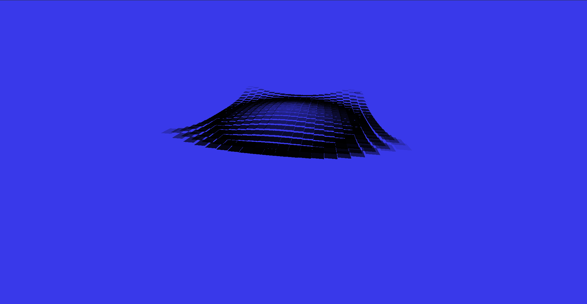

# Waves Animation

## The Waves Animation script uses the [Web Animation API](https://developer.mozilla.org/ru/docs/Web/API/Web_Animations_API/Using_the_Web_Animations_API) to animate a web page.

### Installation and use
> You can install the script by cloning/downloading this repository and running Live Server in VS Code. It is also possible to pull the image from the docker hub [ docker pull alekstar79/waves-animation ] and run [ docker run -d -p 80:80 --rm --name waves-animation alekstar79/waves-animation ]. For ease of use, a Makefile has been created with short commands [ pull, run, stop ]. Or just open the index file [ index.html ] in any browser.

